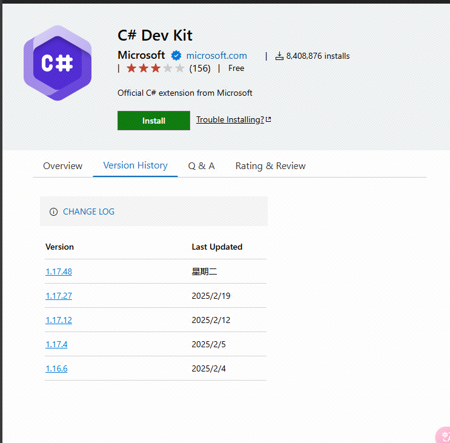

# VSIX 直接下载 Chrome 扩展（Generate By AI）

## 功能说明

本扩展可自动将 Visual Studio Marketplace 的版本历史表中的版本号转换为直接下载链接：

✅ 自动检测版本历史表

✅ 为每个版本号添加VSIX直接下载链接

✅ 支持从URL参数自动解析扩展名称

✅ 兼容 Chrome 最新版本

## 安装步骤

1. 克隆本仓库到本地
2. 打开 Chrome 浏览器，访问 `chrome://extensions/`
3. 启用右上角的「开发者模式」
4. 点击「加载未打包的扩展程序」，选择本仓库目录

## 使用方法

访问任意扩展详情页（如：`https://marketplace.visualstudio.com/items?itemName=ms-dotnettools.csdevkit`）

🔍 版本历史表将自动出现下载链接：

## 技术说明

### itemName 参数解析

- 优先从URL参数获取 `?itemName=Publisher.ExtensionName`
- 备用方案：从页面meta标签获取扩展信息

## 注意事项

⚠️ 需要保持扩展启用状态

⚠️ 仅适用于 marketplace.visualstudio.com 域名

⚠️ 需要网络连接正常访问微软服务器

## 兼容性

Chrome 89+ | Edge 89+ | 其他 Chromium 内核浏览器
